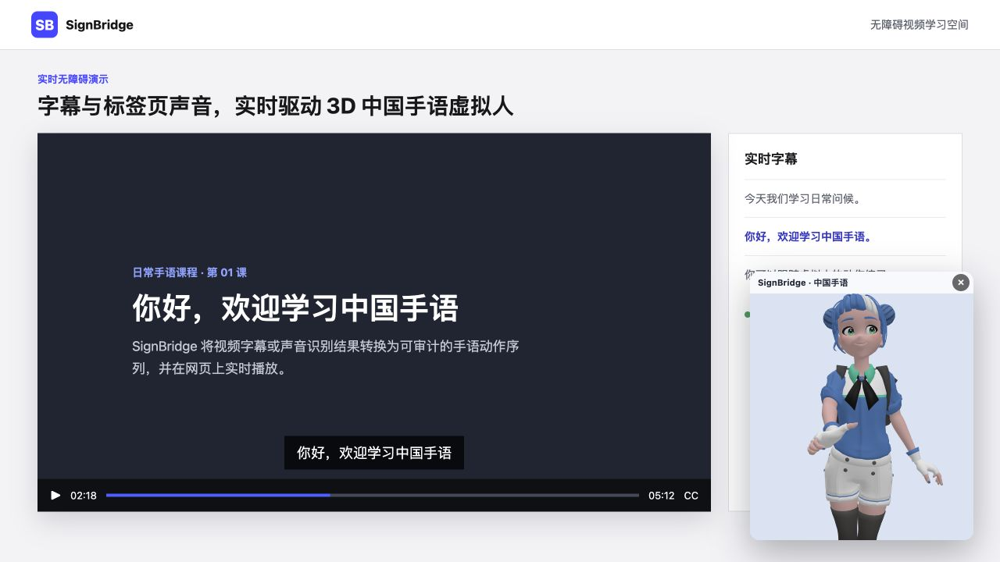
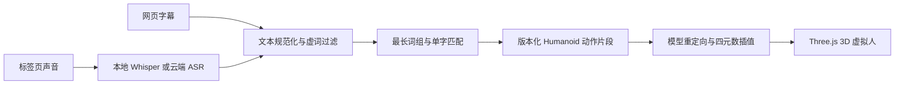

# SignBridge

**把网页视频的字幕与标签页声音实时转换为可审计、可扩展的 3D 中国手语动画，并支持浏览器内本地 Whisper。**

[](https://github.com/feifei9126/signbridge/actions/workflows/verify.yml)
[](LICENSE)
[](https://developer.chrome.com/docs/extensions/develop/migrate/what-is-mv3)
[](#工作原理与边界)
[](#两种声音识别方式)

SignBridge 是一个面向视频无障碍场景的 Chrome 扩展。它可以读取网页可用字幕，或捕获当前标签页的声音进行识别，再通过网页上的 3D 虚拟人播放中国手语动作。与不可解释的端到端生成不同，当前动作由结构化词典、版本化动作片段和统一 Humanoid 骨骼映射驱动，便于逐条检查、修正和扩展。



## 三步快速上手

### 1. 下载并构建

需要 Node.js 20.19 或更高版本。

```bash
git clone https://github.com/feifei9126/signbridge.git
cd signbridge/signbridge
npm install
npm run build
```

### 2. 加载扩展

打开 `chrome://extensions`，开启“开发者模式”，点击“加载已解压的扩展程序”，选择刚生成的 `signbridge/dist/` 目录。

### 3. 开始翻译

打开包含视频的网页，点击 SignBridge 扩展图标并启动翻译：

- 已有 CC 字幕：开启视频字幕，虚拟人会读取并播放已收录动作。
- 没有字幕：在“声音识别设置”中一键部署本地 Whisper，或配置云端 ASR，然后开启“视频声音”。

要求 Chrome 116 或更高版本。声音识别捕获的是当前标签页音频，不读取电脑麦克风。

## 核心特性

- **字幕与视频声音双输入**：支持 TextTrack、常见网页字幕节点，以及 `tabCapture` 标签页音频。
- **隐私优先的本地识别**：Transformers.js + ONNX Runtime Web 在浏览器内运行 Whisper，模型首次下载后缓存复用。
- **可替换的云端 ASR**：支持 OpenAI-compatible 音频转写端点，密钥仅保存在 `chrome.storage.local`。
- **真实 3D 手语覆盖层**：Three.js + glTF 虚拟人，可拖动浮窗、旋转模型、上下平移和滚轮缩放。
- **可审计动作词典**：52 个结构化 CSL 词条、172 个查找别名、16 个单字回退，未知词不会伪装成错误翻译。
- **完整动作制作工具链**：内置姿势编辑器、关键帧录制器、标准 Humanoid 骨骼映射和 REST 增量动作格式。

## 两种声音识别方式

| 模式         | 数据位置           | 配置成本                 | 适用场景                   |
| ------------ | ------------------ | ------------------------ | -------------------------- |
| 本地 Whisper | 音频留在浏览器     | 首次一键下载模型         | 注重隐私、可离线复用       |
| 云端 ASR     | 音频发送到自选服务 | 填写端点、模型和 API Key | 追求更高识别精度或统一服务 |

本地模式默认建议从 `tiny` 开始。性能较好的设备可选择 `base` 或 `small`。模型会根据浏览器语言优先使用 Hugging Face 官方源或镜像，并在下载失败时自动回退。

## 工作原理与边界



当前版本是**词典驱动的中国手语动画系统**，不是完整的通用 AI 手语翻译器。它能稳定播放已经人工确认的词条，未知词会跳过；词典覆盖率、CSL 语法重排、非手控特征和动作质量仍决定最终效果。这个边界是有意保留的：错误动作不会被当成正确翻译输出，动作资产也可以逐条回归验证。

更详细的设计见[架构文档](docs/architecture.md)。

## 文档

- [架构与数据流](docs/architecture.md)
- [添加和调试手语动作](docs/gesture-authoring.md)
- [常见问题](docs/faq.md)
- [贡献指南](CONTRIBUTING.md)
- [安全策略](SECURITY.md)
- 构建后的扩展内还提供“帮助文档”“姿势编辑器”和“录制工具”入口。

## 开发与验证

所有开发命令都在内层扩展目录执行：

```bash
cd signbridge
npm run dev       # 持续构建
npm run verify    # 构建 + ESLint + 40 项测试 + Prettier 检查
```

主要技术栈：Chrome Extension Manifest V3、Three.js、glTF、Transformers.js、ONNX Runtime Web、esbuild 和 Node.js Test Runner。

## 路线图

- [x] 多站点字幕捕获与标签页声音识别
- [x] 本地 Whisper 一键部署与云端 ASR 配置
- [x] Humanoid 动作空间、姿势编辑器和关键帧录制器
- [x] 句内多个已知词连续播放
- [ ] 扩展至 200+ 经过人工验收的 CSL 词条
- [ ] CSL 语法重排与非手控特征
- [ ] glTF AnimationClip 动作资产导入
- [ ] 自动动作截图回归与模型重定向校验

## 参与贡献

欢迎提交经过验证的手语词条、模型适配、字幕站点适配、测试和文档改进。开始前请阅读[贡献指南](CONTRIBUTING.md)，并先运行：

```bash
cd signbridge
npm run verify
```

提交 Bug 时请附上网站、浏览器版本、复现步骤、控制台中以 `[SB]` 开头的日志，以及不含隐私内容的截图。动作贡献应说明 gloss、手形、位置、朝向、运动和验证依据。

## License

[MIT](LICENSE) © SignBridge Contributors
